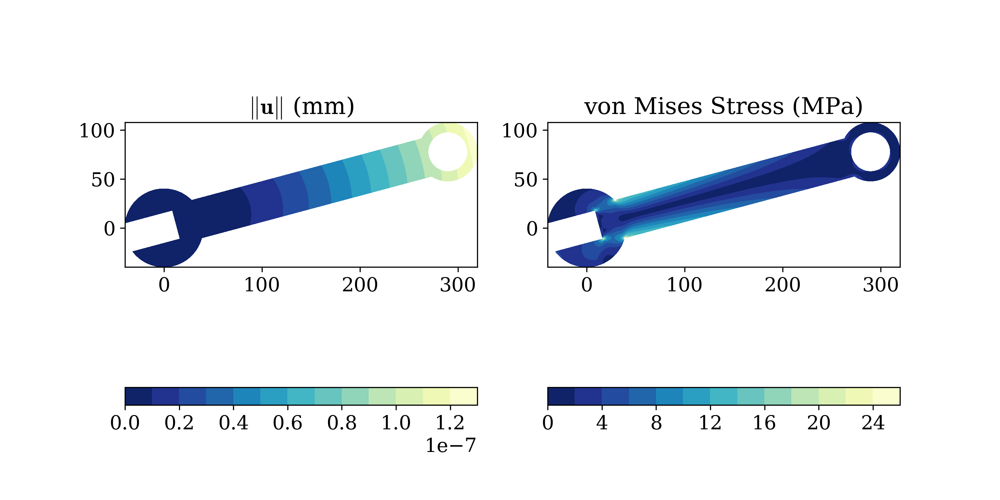

# SolidsPy based learning experiences

## Introduction

This repo contains various learning experinces using the bi-dimensional finite element code SolidsPy.
he code, which has been developed by the Applied Mechanics Group at Universidad EAFIT, is structured to be used
as a stand-alone application or through the combination of independent modules. The modules used in the different
notebooks follow the same structure of those in the code.
The code is available in the [Applied Mechanics' repository](https://github.com/AppliedMechanics-EAFIT/SolidsPy)

## Contents

* [01: Strain analysis at material point](https://nbviewer.jupyter.org/github/jgomezc1/SolidsPy_experiences/blob/master/notebooks/analisis_dformacion/analisis_deformacion.ipynb)

* [02: Response of a trapezoidal dam](https://nbviewer.jupyter.org/github/jgomezc1/SolidsPy_experiences/blob/master/notebooks/analisis_presa/01_solidspy_dam_design.ipynb)

* [03: The Jacobian operator](https://nbviewer.jupyter.org/github/jgomezc1/SolidsPy_experiences/blob/master/notebooks/jacobian/jacobiano.ipynb)

* [04: Modelación computacional: taller 1](https://nbviewer.jupyter.org/github/jgomezc1/SolidsPy_experiences/blob/master/notebooks/taller_1_modelacion/taller1.ipynb)

